<div align="center">

<h1>Hi 👋, I'm Aben Wilson</h1>

### 💻 Software Developer • Full-Stack • Mobile • Cloud

Building ideas into useful digital experiences.

<p>
  <a href="https://www.linkedin.com/in/aben-wilson-11601a348" target="_blank">
    
  </a>
  <a href="mailto:abenwilson1@gmail.com">
    
  </a>
  <a href="https://github.com/Abenwilson" target="_blank">
    
  </a>
</p>

</div>

---

## 🚀 About Me

I'm an **MCA student and passionate Software Developer** who enjoys turning ideas into practical, user-friendly applications.

```text
💡 Think → 🛠️ Build → 🧪 Improve → 🚀 Deploy
```

---

## 🧑‍💻 What I Work With

- 📱 **Mobile & Web:** Flutter, JavaScript, HTML, CSS, REST APIs
- 🐍 **Backend:** Python, Node.js, PHP
- ☁️ **Cloud & DB:** Firebase, Supabase, MySQL, MongoDB

<p>
  
  
  
  
  
  
  
  
  
</p>

---

## 💼 Featured Projects

| Project | Type | What it does | Stack |
| --- | --- | --- | --- |
| ⚽ **KickPro** | Web App | Football management platform connecting players, coaches, scouts, clubs and tournaments | JavaScript • Node.js • Supabase |
| 🎬 **CreatorBridge** | Mobile App | Lets content creators hire, message and collaborate with video editors | Flutter • Firebase • BLoC |
| ♻️ **ShareCycle** | Full-Stack | Community platform for re-using household items with messaging and pickup tracking | PHP • MySQL • JS |

---

## 🎓 Education

- 🔵 **MCA** (Master of Computer Applications) — 2025 – 2027 *(pursuing)*
- 🟢 **BCA** (Bachelor of Computer Applications) — graduated 2025

---

## 📊 GitHub Stats

<p align="center">
  
</p>

<p align="center">
  
  
</p>

---

<div align="center">

## 🟢 Currently Available

**Available for Immediate Joining • Open to Software Development Opportunities**

💙 Let's Build Something Great Together • LEARN • BUILD • CREATE • GROW

</div>
